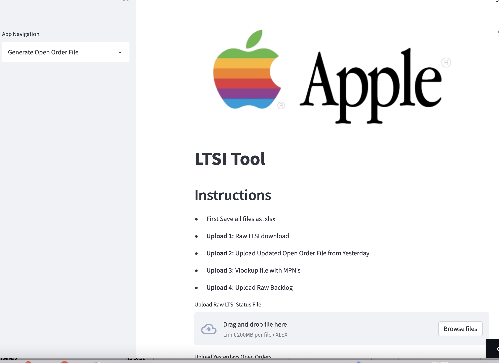
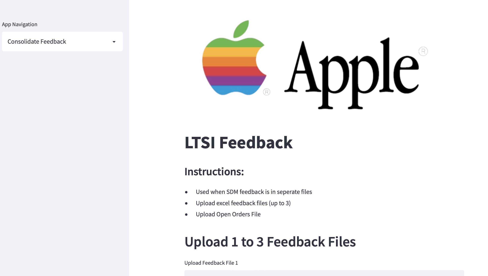

# LTSI Automation Tool

---
## Description
- The motivation behind this tool was to find an easy to use solution to a highly manual task. 
- I built this tool to automate the task and thus improve team efficiency, accuracy and overall output. 
- By creating this tool I hope to save the team between 8-10 hours per week. 
- I learned a great deal about data manipulation in pandas and about deploying a project for others to use. 

---

## Table of Contents
- [Installation](#Installation)
- [Usage/ Instructions](#Usage)
- [License](#license)

---

## Installation
No install is required to run this project. Instead just follow the following link:

https://share.streamlit.io/cameronlooney/ltsi/app.py

---

## Usage 
### LTSI Open Orders Page
<kbd>

</kbd>

#### **Instructions** 
**Step 1**: Download lTSI raw file and Raw Backlog.  
**Step 2**: Save all files with .xlsx extension  
**Step 3**: **Upload 1:** After saving raw LTSI as .xlsx upload it here  
**Step 4**: **Upload 2:** Upload your Open Order File (most up to date version).  
**Step 5**: **Upload 3:** Upload excel file with MPNs (vlookup sheet). This is the only sheet required and only needs to be updated when new MPNs need to be added  
**Step 6**: **Upload 4:** After saving Raw Backlog as .xlsx upload it here   
**Step 7**: **Upload 4:** Generate Output  
 
Note: Please keep column names consistent as changes to name's can crash program. This will hopefully be fixed in future updates
 

### Consolidate Feedback
<kbd>

</kbd>

#### **Instructions**
**Step 1**: Gather feedback files from SDM.  
**Step 2**: Upload 1-3 files with feedback to tool.  
**Step 3**: Upload your up-to-date Open Orders File  
**Step 4**: Generate updated Open Order File
 
 

### Feedback/ Issue Form
<kbd>

</kbd>

#### **Instructions**
**Step 1**: Add name.  
**Step 2**: Add email.  
**Step 3**: Add message 
Please be as descriptive as possible if problem is encountered. Include the error message and also the steps to reproduce the error if possible.   
**Step 4**: Send message, I will get back to you as soon as possible.
 
 

---

## License 
All rights are owned by Apple Computer, Inc.

---
